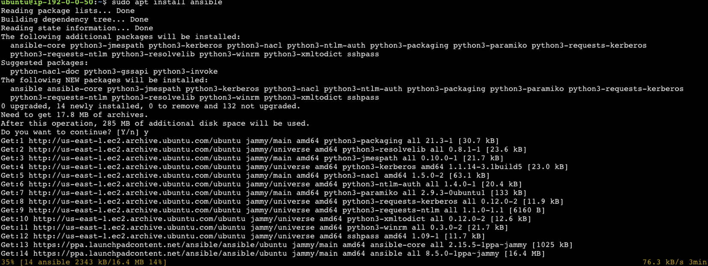
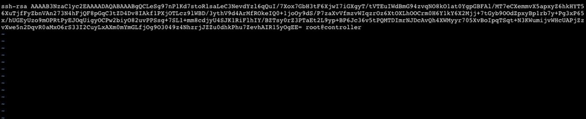
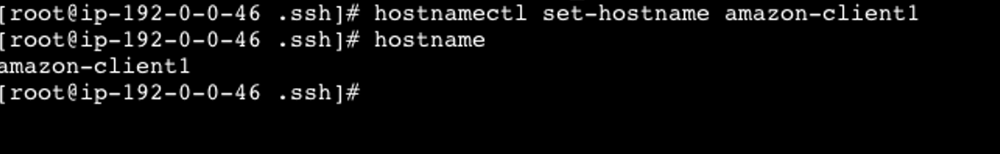
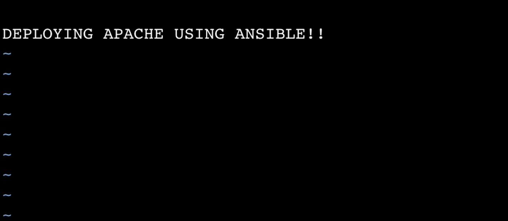

# Ansible Playbooks Project

In this project, I created Ansible playbooks for installing Apache and Git on multiple Ubuntu and Amazon Linux servers, using variables and handlers. I set up the architecture on AWS and configured several client servers through an Ansible controller.

# Project Steps

## Step 1: Setting up our Ansible architecture

First, launch five EC2 instances in us-east-1. Using the free tier options, launch three ubuntu servers and two amazon linux 2 servers. 

Under advanced details, make sure to select an EC2 SSM role for the IAM instance profile to be able to connect to the instances via the Session Manager.

Also, make sure the security group attached to the instances allows inbound SSH traffic.

Once they have launched, update their names, designating one of the ubuntu servers as the controller, and the other two as clients. Assign names to the amazon linux 2 clients as well.

## Step 2: Setting up the controller

Connect to the ubuntu-controller EC2 instance using Session Manager.

First, check for Python and then install Ansible on the ubuntu controller.

To install Ansible, use the official documentation: [Ansible Documentation](https://docs.ansible.com/ansible/latest/installation_guide/installation_distros.html#installing-ansible-on-ubuntu)

Verify Ansible has been installed with the command `ansible --version`.

## Step 3: Key Pairs

Switch to the root user in the controller and generate an SSH key pair.

Copy the public key from the .ssh directory.

Connect to the amazon-client1 EC2 instance via the Session Manager. Switch to the root user.

Paste the public key into the authorized_keys file in the .ssh directory of the amazon-client1 server using the Vim text editor. Press I to insert, then paste the public key. Press Esc, then type `:wq!` to save and quit.

Now, connect to the ubuntu-client1 EC2 instance via the Session Manager. Switch to the root user.

Follow the same steps to paste the public key into the authorized_keys file in the .ssh directory.

## Step 4: Setting hostnames

Set hostnames for both client servers (amazon-client1 and ubuntu-client1) with the `hostnamectl set-hostname` command:

## Step 5: Testing connectivity

To test connectivity, SSH from the controller into ubuntu-client1.

To obtain the private IP address of the ubuntu-client1 server, use the command `ifconfig`.

Next, SSH from the controller into amazon-client1 following the same steps.

## Step 6: Repeat Steps 2-5

Repeat steps 2-5 for the remaining two servers (ubuntu-client2 and amazon-client2).

## Step 7: Edit inventory file

On the controller, navigate to the ansible directory with the `cd /etc/ansible/` command, find the inventory file called hosts, and edit the file using the `vim` command.

Add the private IP addresses of the four clients and save the changes.

## Step 8: Ping client servers

Use the ansible ad hoc command `ansible -m ping all` to test connectivity to all four hosts.

You should get a ping pong response for each client server.

## Step 9: Ansible Playbook

Create a playbook to deploy apache and git on all client servers.

Here is the code I wrote for this project: 
[Apache & Git Playbook](./apache-git-playbook.yml)

## Step 10: Adding index.html file

Create the index.html file for the webservers on the controller using the command `vim index.html`. Insert a message you would like the web servers to display, such as the one shown below.

## Step 11: Adding the playbook file

Create the Ansible playbook YAML file on the controller using the `vim` command. You can choose any name for the file. Insert the code from Step 9 into the file and save changes.

## Step 12: Running the playbook

Use the `ansible-playbook` command to run the playbook. The argument of the command is the file name. (Note: Python must be installed on the client servers for the playbook to run successfully.)

Most of the Ansible modules are idempotent, so the first time you run the playbook you will see "changed" under the tasks. If you run the playbook again, you will see "ok" in green under the tasks.

## Step 13: Test the webservers

Test each of the client servers through the web browser using their public IPs. You should see your index.html message on each one.

