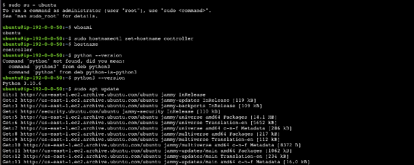

# Ansible Playbooks Project

In this project, I created Ansible playbooks for installing Apache and Git on multiple Ubuntu and Amazon Linux servers, using variables and handlers.

# Project Steps

## Step 1: Setting up our Ansible architecture

First, launch five EC2 instances in us-east-1. Using the free tier options, launch three ubuntu servers and two amazon linux 2 servers. 

Under advanced details, make sure to select an EC2 SSM role for the IAM instance profile to be able to connect to the instances via the Session Manager.

Once they have launched, update their names, designating one of the ubuntu servers as the controller, and the other two as clients. Rename the amazon linux 2 clients as well.

## Step 2: Setting up the controller

Connect to the ubuntu-controller EC2 instance using Session Manager.

First, check for Python and then install Ansible on the ubuntu controller.

To install Ansible, use the official documentation: [Ansible Documentation](https://docs.ansible.com/ansible/latest/installation_guide/installation_distros.html#installing-ansible-on-ubuntu)

